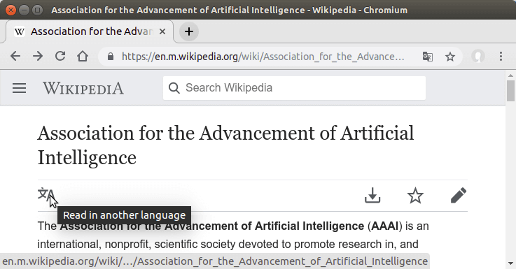

# A/IS Ethics Organizations

          

---

_**See also:
[ais-ethics-open-groups](https://github.com/fititnt/ais-ethics-open-groups) |
ais-ethics-orgs |
[ais-ethics-standards](https://github.com/fititnt/ais-ethics-standards)**_

---

 **Curated list of organizations related to Ethics of
Autonomous and Intelligent Systems (A/IS).** AI Ethics, Algorithmic Bias,
Ethics of Automation, Existential Risks, Friendly Artificial Intelligence,
Future of Work, Human Rights, Information Ethics, Machine Ethics, Philosophy
of AI, Privacy, Roboethics, Robot Rights...

# Organizations

Organizations are listed according to their headquarters, even if they operate
worldwide. The same organization may appear more than once if there is a
large enough branch on a different continent. The _Field/Focus_ It may contain
extra terms , but in general, the term "artificial intelligence" and "ethics"
will not be displayed since all mentioned here must work with both at some level.

## Africa

| Country | City | Formation | Field/Focus | Name |
| --- | --- | --- | --- | --- |
| South Africa | | 2007 | Information ethics | **[African Centre of Excellence for Information Ethics](https://www.up.ac.za/african-centre-of-excellence-for-information-ethics/)**   **[African Network for Information Ethics (ANIE)](https://www.up.ac.za/african-centre-of-excellence-for-information-ethics/article/2616060/anie-website)** |

_Do you have suggestions to add? [See how to contribute](#contributions)._

## Asia

| Country | City | Formation | Field/Focus | Name |
| --- | --- | --- | --- | --- |
| China | Beijing | 2007 [(?)](https://www.tencent.com/en-us/articles/80155.html) | | **[Tencent Research Institute](http://www.tisi.org/)** [review-lang](#review-lang)  Original: <strong><em lang="zh">腾讯研究院</em></strong> [review-lang](#review-lang)   _Extra: Wikipedia_ |
| Japan | Shinjuku, Tokyo | 1986 | | **[Japanese Society for Artificial Intelligence (JSAI)](http://www.ai-gakkai.or.jp)**  Original: <strong><em lang="jp">人工知能学会</em></strong> [review-lang](#review-lang)   _Extra: [Facebook](https://www.facebook.com/aigakkai); [Twitter](https://twitter.com/ai_gakkai); [Youtube](https://www.youtube.com/channel/UCcwBbkwoc6utubVho0Jlr2w); [Wikipedia](https://ja.wikipedia.org/wiki/%E4%BA%BA%E5%B7%A5%E7%9F%A5%E8%83%BD%E5%AD%A6%E4%BC%9A)_ |

_Do you have suggestions to add? [See how to contribute](#contributions)._

## Europe

| Country | City | Formation | Field/Focus | Name |
| --- | --- | --- | --- | --- |
| Netherlands | Eindhoven | 2007 | | **[4TU.Centre for Ethics and Technology (4TU.Ethics)](https://ethicsandtechnology.eu/)**   _Extra: [Twitter](https://twitter.com/4tuethics); [Facebook](https://www.facebook.com/4TUEthics-1211139425660661/); Wikipedia_ |
| England | Cambridge | 2012 | Existential risks | **[Centre for the Study of Existential Risk (CSER)](https://www.cser.ac.uk/)**   _Extra: [Facebook](https://www.facebook.com/CSERCambridge/); [Twitter](https://twitter.com/CSERCambridge); [Wikipedia](https://en.wikipedia.org/wiki/Centre_for_the_Study_of_Existential_Risk); [Youtube](https://www.youtube.com/channel/UCoMIcy9-8QxuhhRSwc9cVQg)_ |
| Italy | | | | **[Artificial Intelligence task force (AI-Gov)](https://ia.italia.it/en/)**   _Extra: [Facebook](https://www.facebook.com/AgIDGovIT/) [l-gen](#l-gen); [Twitter](https://twitter.com/AgIDgov) [l-gen](#l-gen);_ |
| Netherlands | The Hague | 2015-12-07 | Roboethics | **[Foundation for Responsible Robotics (FRR)](https://responsiblerobotics.org/)**   _Extra: [Twitter](https://twitter.com/resprobotics); [Wikipedia](https://en.wikipedia.org/wiki/Foundation_for_Responsible_Robotics)_ |

_Do you have suggestions to add? [See how to contribute](#contributions)._

## North America

| Country | City | Formation | Field/Focus | Name |
| --- | --- | --- | --- | --- |
| USA | New York, NY | 2017-11-15 | Social Implications | **[AI Now Institute at NYU (AI Now)](https://ainowinstitute.org)**   _Extra: [Medium](https://medium.com/@AINowinstitute); [Twitter](https://twitter.com/ainowinstitute); [Youtube](https://www.youtube.com/AINowInstitute); [Wikipedia](https://en.wikipedia.org/wiki/AI_Now_Institute)_ |
| USA | Palo Alto, CA | 1979 | | **[Association for the Advancement of Artificial Intelligence (AAAI)](http://www.aaai.org/)**   _Extra: [Facebook](https://www.facebook.com/AAAI-Association-for-the-Advancement-of-Artificial-Intelligence-36428078710/); [Twitter](https://twitter.com/RealAAAI); [Wikipedia](https://en.wikipedia.org/wiki/Association_for_the_Advancement_of_Artificial_Intelligence)_ |
| USA | Berkeley, CA | 2000 | Friendly Artificial Intelligence | **[Machine Intelligence Research Institute (MIRI)](https://intelligence.org/)**   _Extra: [Facebook](https://www.facebook.com/MachineIntelligenceResearchInstitute); [Twitter](https://twitter.com/MIRIBerkeley); [Wikipedia](https://en.wikipedia.org/wiki/Machine_Intelligence_Research_Institute)_ |
| USA | San Francisco, CA | 2015-12-11 | Friendly Artificial Intelligence | **[OpenAI](https://openai.com/)**   _Extra: [Facebook](https://www.facebook.com/openai.research/); [Twitter](https://twitter.com/openai); [Wikipedia](https://en.wikipedia.org/wiki/OpenAI)_ |
| USA | San Francisco, CA | 2016-09-28 | | **[Partnership on AI](https://www.partnershiponai.org/)**   _Extra: [Facebook](https://www.facebook.com/partnershipai); [Twitter](https://twitter.com/partnershipai); [Wikipedia](https://en.wikipedia.org/wiki/Partnership_on_AI)_ |
| USA | Princeton, NJ | | Political Theory | **[Princeton University Dialogues on AI and Ethics](https://aiethics.princeton.edu/about/)**   _Extra: Wikipedia_ |

_Do you have suggestions to add? [See how to contribute](#contributions)._

## Oceania

_Do you have suggestions to add? [See how to contribute](#contributions)._

## South America

_Do you have suggestions to add? [See how to contribute](#contributions)._

# Other organizations
## Strategies to find A/IS ethics organizations
This area explain some strategies to find other A/IS Ethics organizations. But
keep in mind that:

* Some strategies will return several false positives.
  - Keep in mind that a different language (and even how websites are designed)
    can make it harder, so be ready to take more time
* Not all organizations are listed on wikipedia
  - ... and the ones that are, maybe not in exact language you are looking for
  - ... but Wikipedia can have several languages of the same page already interliked! 😀
    - **See [FAQ:Wikipedia Interlanguage links](#wikipedia-interlanguage-links)**.
      Pages with Category of articles in one language can have different
      organizations on others. **Explicit warning: English does not have all organizations**.
* If you have the name in the original language of a organization (or the terms
  used by these groups of organizations), copy and paste these terms on some
  search engine. **Explicit warning: English will not necessary show more results on search engines**.
    - [ais-ethics-l10n](https://github.com/fititnt/ais-ethics-l10n) have a draft
      of some key terms that could help with search engines and social networks
      for organizations and groups.

### Artificial Intelligence associations
Artificial intelligence associations _have a great chance_ of either themselves
or some of their extensions be also one A/IS Ethics organization.

- A good **starting** point is [Category:Artificial intelligence associations on Wikipedia (English)](https://en.wikipedia.org/wiki/Category:Artificial_intelligence_associations).

### Computer science organizations

Computer science organizations _sometimes have a chance_ of either themselves
or some of their extensions be also one A/IS Ethics organization.

- A good **starting** point is [Category:Computer science organizations on Wikipedia (English)](https://en.wikipedia.org/wiki/Category:Computer_science_organizations).

### Ethics organizations

Ethics organizations _sometimes have a chance_ of either themselves
or some of their extensions be also one A/IS Ethics organization.

- A good **starting** point is [Category:Ethics organization on Wikipedia (English)](https://en.wikipedia.org/wiki/Category:Ethics_organizations).

<!--
## Other

- http://www.aiandsociety.org/
- https://www.unog.ch/80256EE600585943/(httpPages)/4F0DEF093B4860B4C1257180004B1B30?OpenDocument

## Considerar adicionar esses tambem em breve

- https://aiethicsinitiative.org
- https://thecenter.mit.edu/
- https://montrealethics.ai/

- https://techethics.ieee.org/contact

- https://www.ethicsnet.com/ (falta localização)

- http://www.eismd.eu/ai4people/about/ (definir endereço de localização; talvez pegar da organização que hospeda o site)

- https://intelligence.org/

- International Center for Information Ethics
  - https://www.i-c-i-e.org/
  - https://www.facebook.com/ICIEInfoEthics
  - https://twitter.com/ICIEInfoEthics
  - "Information ethics"
  - (No Wikipedia)
  - (Do not specify a headquarter)

## Souces of info
- https://en.wikipedia.org/wiki/Category:Ethics_organizations
- https://en.wikipedia.org/wiki/Category:Artificial_intelligence_associations
- https://en.wikipedia.org/wiki/Category:Computer_science_organizations

-->

# Extra informations

## Footnotes

- <b id="review-lang">review-lang</b>: This term requires review of a native
  speaker or a official source that confirms. See  [ais-ethics-orgs/issues/1](https://github.com/fititnt/ais-ethics-orgs/issues/1)
- <b id="l-gen">l-gen</b>: The link may be is more generic (like from a big
  area of government or a university) and not focused on the organization cited
  on this document.

## FAQ

### Why the _name-of-the-organization_ is listed on a specific region and not as "international"?

The adress used is headquarters of the organization. The same organization may
appear more than once if there is a _large_ enough branch on a different
continent. [Suggestions of missing extra branches are welcome!](#contributions).

### Wikipedia Interlanguage links
All links to wikipedia pages cited here very likely have links to versions of
the same content (that can not be just a translation, but have different content).
The Wikipedia help call they [Interlanguage links](https://en.wikipedia.org/wiki/Help:Interlanguage_links).

#### Desktop access

If you access wikipedia with the desktop view, is less obvious the alternatives
in other languages.

- (Left-to-right languages), look at the bottom left, in the area with a term equivalent to "Languages"
- (Right-to-left languages) Look at the bottom right, in the area with a term equivalent to "Languages"

The next images use as example wikipedia page of [Association for the Advancement of Artificial Intelligence](https://en.wikipedia.org/wiki/Association_for_the_Advancement_of_Artificial_Intelligence)
to switch to the persian page [انجمن پیشبرد هوش مصنوعی](https://fa.wikipedia.org/wiki/%D8%A7%D9%86%D8%AC%D9%85%D9%86_%D9%BE%DB%8C%D8%B4%D8%A8%D8%B1%D8%AF_%D9%87%D9%88%D8%B4_%D9%85%D8%B5%D9%86%D9%88%D8%B9%DB%8C);

The next image shows the icon on 

#### Mobile access

If you access wikipedia with the mobile view, the link to swich languages is one
of the firsts after the page title.

The next image shows the icon on Left-to-right languages.

The next image shows the icon on right-to-left languages.

The next image shows the menu with all languages available
after any language switch is choosen on wikipedia
mobile view.

### Can I do ... with this list?

Yes, the [public domain](#license) license allow this, even without asking
first if you can do or not. If is a improvement to this main list, see
[Contributions](#contributions).

# Contributions
Ways to contribute with suggestions, critics, etc:

- [Open a issue](https://help.github.com/articles/creating-an-issue/)
- [Make a Pull request](https://help.github.com/articles/about-pull-requests/)
- Talk via e-mail:
  - with the maintainer: Emerson Rocha <rocha@ieee.org>.

One **help need here is to discover organizations in regions of the world
with much less listed options**.

# License

To the extent possible under law, [Emerson Rocha](https://github.com/fititnt)
has waived all copyright and related or neighboring rights to this work to
[Public Domain](UNLICENSE).